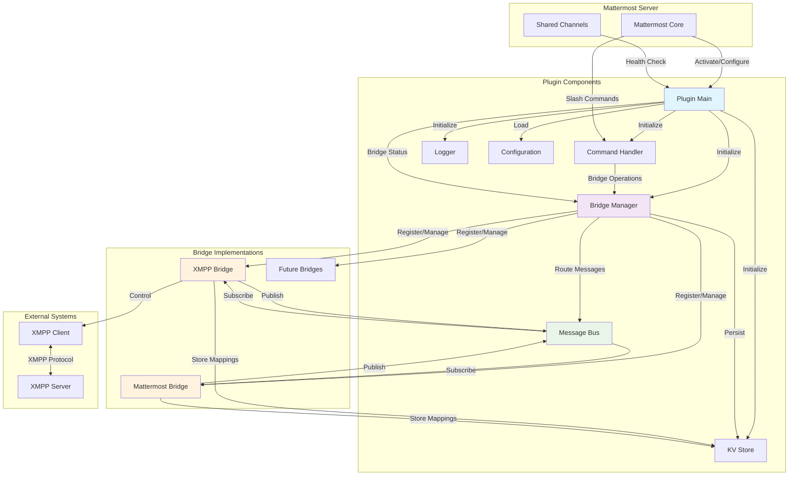
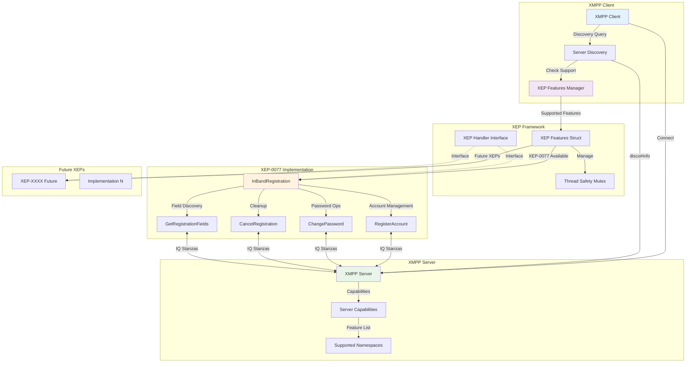
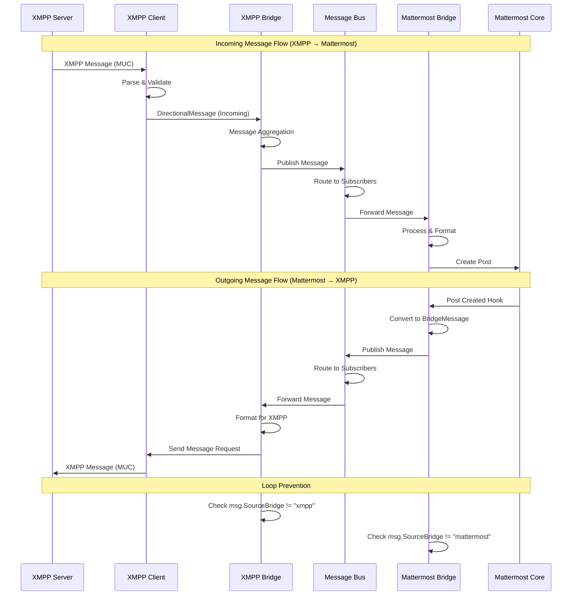
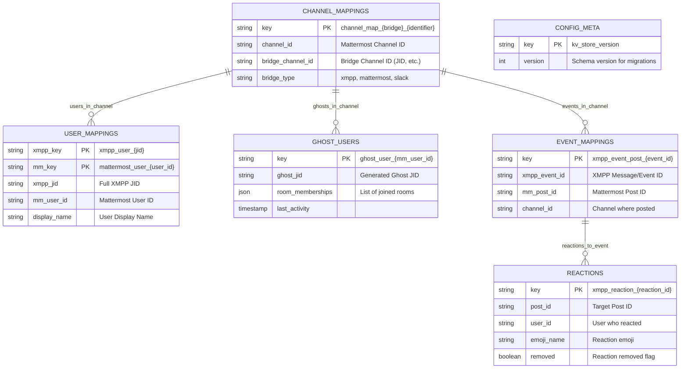
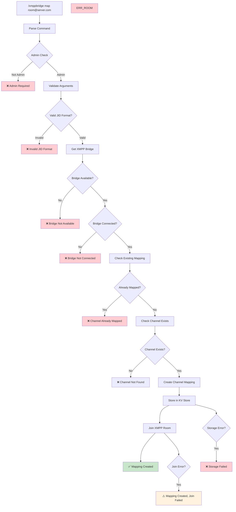
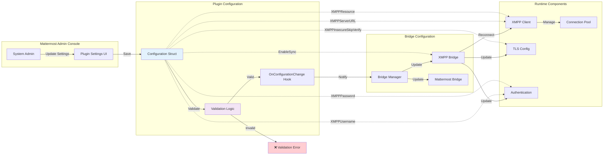

# Mattermost XMPP Bridge Plugin Architecture

## Overview

The Mattermost XMPP Bridge Plugin provides bidirectional message synchronization between Mattermost and XMPP servers through a comprehensive bridge architecture. The plugin is designed with extensibility in mind, supporting multiple bridge types and protocols through a unified interface.

## Core Design Principles

- **Bridge-Agnostic Architecture**: Extensible design supporting future bridges (Slack, Discord, etc.)
- **Bidirectional Communication**: Real-time message synchronization in both directions
- **Message Bus Pattern**: Centralized routing system for decoupled communication
- **Thread-Safe Operations**: Goroutine-safe concurrent message processing
- **Persistent Configuration**: KV store-based persistence for mappings and user data
- **Admin Security**: System administrator access control for all operations

## System Architecture



## Bridge System Architecture

The bridge system implements a pluggable architecture where each bridge type implements a common interface, enabling seamless addition of new protocols.

```mermaid
graph TB
    subgraph "Bridge Interface"
        BI[Bridge Interface]
        BI --> |Lifecycle| LC[Start/Stop/UpdateConfig]
        BI --> |Messaging| MSG[GetMessageChannel/SendMessage]
        BI --> |Mappings| MAP[Create/Get/DeleteChannelMapping]
        BI --> |Health| HEALTH[IsConnected/Ping/ChannelMappingExists]
        BI --> |Users| USR[GetUserManager/GetUserResolver]
        BI --> |Handlers| HAND[GetMessageHandler]
    end
    
    subgraph "XMPP Bridge Implementation"
        XB[XMPP Bridge]
        XMH[XMPP Message Handler]
        XUR[XMPP User Resolver]
        XUM[XMPP User Manager]
        XC[XMPP Client - mellium.im/xmpp]
    end
    
    subgraph "Mattermost Bridge Implementation"
        MB[Mattermost Bridge]
        MMH[MM Message Handler]
        MUR[MM User Resolver]
        MUM[MM User Manager]
        API[Mattermost API]
    end
    
    subgraph "Future Bridge Example"
        SB[Slack Bridge]
        SH[Slack Handler]
        SR[Slack Resolver]
        SAPI[Slack API]
    end
    
    %% Interface implementation
    BI -.->|implements| XB
    BI -.->|implements| MB
    BI -.->|implements| SB
    
    %% XMPP Bridge components
    XB --> XMH
    XB --> XUR
    XB --> XUM
    XB --> XC
    
    %% Mattermost Bridge components
    MB --> MMH
    MB --> MUR
    MB --> MUM
    MB --> API
    
    %% Future bridge components
    SB --> SH
    SB --> SR
    SB --> SAPI
    
    %% External connections
    XC <--> XMPP_SRV[XMPP Server]
    API <--> MM_CORE[Mattermost Core]
    SAPI <--> SLACK_API[Slack API]
    
    style BI fill:#e3f2fd
    style XB fill:#fff3e0
    style MB fill:#e8f5e8
    style SB fill:#fce4ec
```



## XEP Extension System Architecture

The XMPP client includes an extensible XEP (XMPP Extension Protocol) framework that dynamically discovers and enables server-supported features.



### XEP Feature Lifecycle

```mermaid
sequenceDiagram
    participant C as XMPP Client
    participant D as Server Discovery
    participant XM as XEP Manager
    participant XEP as XEP-0077
    participant S as XMPP Server
    
    Note over C,S: Server Capability Detection
    
    C->>+D: Connect & Authenticate
    D->>+S: disco#info query
    S->>-D: Server capabilities & namespaces
    D->>-C: Feature discovery complete
    
    Note over C,S: XEP Initialization (Async)
    
    C->>+XM: detectServerCapabilities()
    XM->>XM: Check jabber:iq:register namespace
    alt XEP-0077 Supported
        XM->>+XEP: NewInBandRegistration()
        XEP->>-XM: Initialized XEP instance
        XM->>XM: features.InBandRegistration = xep
        XM->>C: XEP-0077 enabled
    else XEP-0077 Not Supported
        XM->>C: XEP-0077 skipped
    end
    XM->>-C: Capability detection complete
    
    Note over C,S: XEP Usage
    
    C->>+XEP: RegisterAccount(jid, request)
    XEP->>+S: IQ set (registration)
    S->>-XEP: IQ result/error
    XEP->>-C: Registration response
```

## Message Flow Architecture

The message bus provides centralized routing for bidirectional message synchronization with loop prevention and scalable message processing.



## Data Model & Storage Schema

The plugin uses Mattermost's KV store for persistent data with a structured key schema supporting multiple bridge types and user mappings.



## Command Processing Flow

The plugin provides slash commands for channel mapping management with comprehensive error handling and admin-only access control.



## Configuration Management

Configuration flows from Mattermost system settings through the plugin to individual bridge instances with validation and hot-reload support.



## Core Components

### Plugin Main (`server/plugin.go`)
- **Lifecycle Management**: Handles plugin activation/deactivation
- **Component Initialization**: Sets up all subsystems in proper order
- **Shared Channels Integration**: Registers for distributed health checks
- **Background Jobs**: Manages periodic maintenance tasks

### Bridge Manager (`server/bridge/manager.go`)
- **Bridge Registry**: Manages multiple bridge instances
- **Message Routing**: Coordinates message bus operations
- **Configuration Propagation**: Updates all bridges on config changes
- **Health Monitoring**: Provides bridge status and connectivity checks

### Message Bus (`server/bridge/messagebus.go`)
- **Publisher-Subscriber Pattern**: Decoupled message routing
- **Loop Prevention**: Prevents infinite message cycles
- **Buffer Management**: Configurable message queues (1000 message buffer)
- **Delivery Guarantees**: Timeout-based delivery with fallback handling

### XMPP Client (`server/xmpp/client.go`)
- **mellium.im/xmpp Integration**: Standards-compliant XMPP implementation
- **MUC Support**: Multi-User Chat for group messaging
- **Connection Management**: Automatic reconnection with exponential backoff
- **Message Parsing**: Structured message handling with XML parsing
- **XEP Extension Support**: Extensible protocol implementation framework
- **Server Capability Detection**: Dynamic feature discovery using disco#info

### XEP Features Framework (`server/xmpp/xep_features.go`)
- **Extensible Architecture**: Struct-based XEP management for scalability
- **Thread-Safe Operations**: Concurrent access protection with read-write mutex
- **Dynamic Feature Discovery**: Server capability-based feature initialization
- **Interface-Based Design**: Common XEPHandler interface for all extensions

### XEP-0077 In-Band Registration (`server/xmpp/xep_0077.go`)
- **Account Registration**: Complete user account creation functionality
- **Password Management**: Account password change operations
- **Registration Cancellation**: Account deletion and cleanup
- **Field Discovery**: Dynamic registration field requirement detection
- **Server Compatibility**: Only initializes when server supports the feature

### Bridge Implementations
- **XMPP Bridge** (`server/bridge/xmpp/`): XMPP protocol integration
- **Mattermost Bridge** (`server/bridge/mattermost/`): Internal Mattermost API integration
- **Message Handlers**: Protocol-specific message processing
- **User Resolvers**: User identity mapping and resolution

## Communication Patterns

### Message Flow Patterns
1. **Producer-Consumer**: Bridges produce/consume messages via message bus
2. **Request-Response**: Command processing with immediate feedback
3. **Event-Driven**: Configuration changes trigger bridge updates
4. **Publisher-Subscriber**: Message bus routes to all interested bridges

### Concurrency Patterns
1. **Goroutine Pools**: Per-bridge message processing
2. **Channel-Based Communication**: Non-blocking message queues
3. **Context Cancellation**: Graceful shutdown coordination
4. **WaitGroup Synchronization**: Coordinated cleanup operations

## Data Persistence

### Storage Strategy
- **KV Store Abstraction**: Pluggable storage backend
- **Structured Keys**: Hierarchical key naming for efficient queries
- **Bridge-Agnostic Schema**: Support for multiple bridge types
- **Migration Support**: Versioned schema for backward compatibility

### Key Patterns
```
channel_map_{bridge}_{identifier} → channel_id
{bridge}_user_{external_id} → mattermost_user_id  
ghost_user_{mattermost_user_id} → ghost_jid
{bridge}_event_post_{event_id} → post_id
```

## Error Handling & Resilience

### Failure Modes
1. **Connection Failures**: Automatic reconnection with backoff
2. **Message Delivery Failures**: Timeout handling with retry logic
3. **Configuration Errors**: Validation with user-friendly error messages
4. **Storage Failures**: Graceful degradation with logging

### Recovery Strategies
1. **Circuit Breaker Pattern**: Prevent cascade failures
2. **Graceful Degradation**: Continue operation with reduced functionality
3. **Health Checks**: Proactive problem detection
4. **Comprehensive Logging**: Structured logging for debugging

## Performance Considerations

### Scalability Features
1. **Buffered Channels**: 1000-message buffers prevent blocking
2. **Message Aggregation**: Multiple message sources per bridge
3. **Concurrent Processing**: Parallel message handling
4. **Connection Pooling**: Efficient resource utilization

### Optimization Techniques
1. **Lazy Initialization**: Components created on demand
2. **Caching Strategies**: In-memory mapping cache
3. **Batch Operations**: Bulk message processing where possible
4. **Resource Cleanup**: Proper goroutine lifecycle management

## Security Model

### Access Control
- **Admin-Only Commands**: System administrator privilege requirement
- **Bridge Isolation**: Separate security contexts per bridge
- **Credential Management**: Secure storage of authentication data
- **TLS Configuration**: Configurable certificate validation

### Data Protection
- **Secure Storage**: Plugin KV store encryption
- **Message Privacy**: No message content logging
- **User Privacy**: Minimal personal data storage
- **Audit Trail**: Command execution logging

## Testing Strategy

### Unit Testing
- **Component Isolation**: Mock dependencies for focused testing
- **Interface Testing**: Bridge interface compliance verification
- **Message Processing**: End-to-end message flow validation
- **Error Scenarios**: Comprehensive failure mode testing

### Integration Testing
- **XMPP Testcontainers**: Automated XMPP server testing
- **Bridge Integration**: Multi-bridge message routing tests
- **Configuration Testing**: Settings validation and propagation
- **Performance Testing**: Load testing with gotestsum
- **XEP Feature Testing**: Doctor command with comprehensive XEP-0077 validation
- **Live Server Testing**: Real user account creation and deletion tests

## Extension Points

### Adding New Bridges

1. **Implement Bridge Interface**:
```go
type MyBridge struct {
    // Bridge-specific fields
}

func (b *MyBridge) Start() error { /* implementation */ }
func (b *MyBridge) GetMessageChannel() <-chan *DirectionalMessage { /* implementation */ }
// ... other Bridge interface methods
```

2. **Create Message Handler**:
```go
type myMessageHandler struct {
    bridge *MyBridge
}

func (h *myMessageHandler) ProcessMessage(msg *DirectionalMessage) error {
    // Process incoming messages from other bridges
}
```

3. **Register with Bridge Manager**:
```go
myBridge := mybridge.NewBridge(logger, api, kvstore, config)
bridgeManager.RegisterBridge("mybridge", myBridge)
```

### Message Type Extensions
- **Rich Content**: Extend BridgeMessage for files, images, reactions
- **Custom Metadata**: Bridge-specific message properties
- **Format Converters**: Content transformation between protocols
- **Message Filtering**: Content-based routing rules

## Deployment & Operations

### Plugin Lifecycle
1. **Installation**: Plugin bundle deployment to Mattermost
2. **Configuration**: Admin console settings configuration
3. **Activation**: Component initialization and bridge startup
4. **Operation**: Real-time message synchronization
5. **Updates**: Hot configuration reload without restart
6. **Maintenance**: Health monitoring and log analysis

### Monitoring & Observability
- **Health Endpoints**: Bridge connectivity status
- **Structured Logging**: JSON-formatted log entries
- **Metrics Collection**: Message throughput and error rates
- **Alerting**: Failed connection and mapping error notifications

## Development Workflow

### Prerequisites
- Go 1.21+ for server development
- Node.js 18+ for webapp development
- Docker for XMPP test server
- golangci-lint for code quality

### Key Commands
```bash
make                    # Build plugin bundle
make test              # Run all tests
make check-style       # Lint and format
make deploy           # Deploy to local Mattermost
make devserver_start  # Start test XMPP server
```

### XMPP Client Doctor Tool (`cmd/xmpp-client-doctor/`)
The doctor command provides comprehensive XMPP connectivity and feature testing:

```bash
# Basic connectivity test
go run ./cmd/xmpp-client-doctor/main.go

# Test specific features
go run ./cmd/xmpp-client-doctor/main.go --test-xep0077 --test-muc --test-dm

# Custom server testing  
go run ./cmd/xmpp-client-doctor/main.go --server example.com:5222 --username user@example.com
```

### Code Organization
```
server/
├── plugin.go              # Main plugin entry point
├── bridge/
│   ├── manager.go         # Bridge management
│   ├── messagebus.go      # Message routing
│   ├── xmpp/             # XMPP bridge implementation
│   └── mattermost/       # Mattermost bridge implementation
├── model/                # Shared interfaces and types
├── config/               # Configuration management
├── command/              # Slash command handling
├── xmpp/                # XMPP client implementation
│   ├── client.go         # Core XMPP client with MUC support
│   ├── xep_features.go   # XEP extension framework
│   └── xep_0077.go       # XEP-0077 In-Band Registration
└── store/               # Data persistence
```

This architecture provides a solid foundation for bidirectional message bridging while maintaining extensibility for future enhancements and additional bridge protocols.